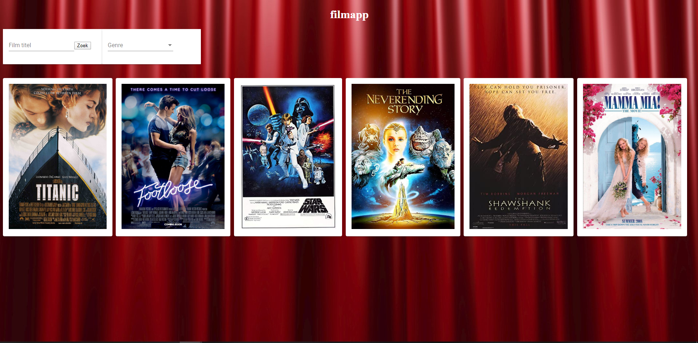

# web4-1920-b1-fe-AudreyBehiels

Voor de webapplicatie te runnen moet je eerst de Backend laten runnen. Dan moet je in de terminal van het VSC project 'cd filmapp' ingeven. Daarna kan je de Frontend runnen met het commando 'npm start'.

# Main pagina

De dropdown van de genres werken maar de actie erachter nog niet.
Als je op een afiche van een film klik dan kom je op de detail pagina van die film terecht, dit werkt echter nog niet.

Filter functie

